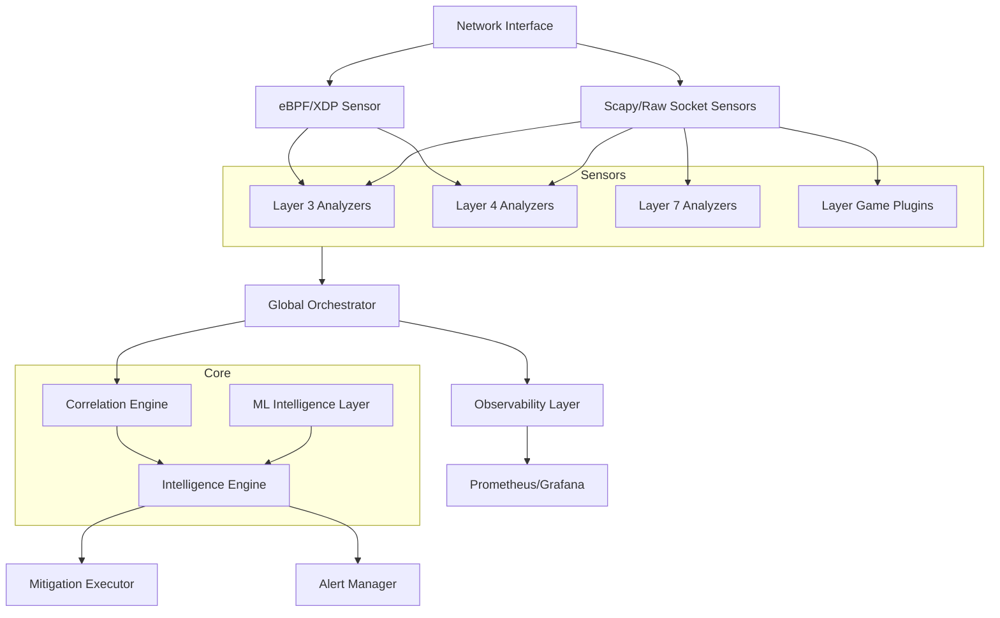

# Comprehensive Project Analysis: under_attack_ddos Boris? No, Antigravity.

This document provides a deep-dive analysis of the current state of the `under_attack_ddos` project, covering architecture, component responsibilities, and integration status.

## 1. Architecture Overview
The system follows a modular, layered architecture designed for high-performance DDoS detection and mitigation.

## 2. Layer Analysis

### 2.1 Layer 3 (L3)
- **Files**: `layer3/ip_flood_analyzer.py`, `layer3/l3_bandwidth_monitor.py`, `layer3/l3_spoofing_detector.py`.
- **Status**: Integrated with eBPF/XDP for high-speed metrics.
- **Role**: Monitors packet rates, bandwidth consumption, and header anomalies at the IP level.

### 2.2 Layer 4 (L4)
- **Files**: `layer4/l4_udp_flood_monitor.py`, `layer4/syn_flood_analyzer.py`.
- **Status**: Features high-performance SYN flood detection leveraging eBPF.
- **Role**: Detects stateful vs stateless UDP floods and TCP SYN floods.

### 2.3 Layer 7 (L7)
- **Files**: `layer7/l7_behavioral_fingerprinter.py`, `layer7/l7_request_rate_analyzer.py`, `layer7/l7_slow_attack_detector.py`.
- **Status**: Focuses on HTTP/Web application layer attacks.
- **Role**: Identifies slow-loris attacks and application-specific flood patterns.

### 2.4 Layer Game (LG)
- **Plugins**: Metin2, Minecraft, FiveM, Source Engine (CS:GO, etc.), SAMP, MTA, TS3, Unreal.
- **Common Logic**: `layer_game/common/game_protocol_parser.py`.
- **Role**: Deep Packet Inspection (DPI) for game-specific protocols to filter malformed packets and brute-force attempts.

## 3. Intelligence & Orchestration

### 3.1 Global Orchestrator
- **File**: `orchestration/under_attack_orchestrator.py`.
- **Role**: The central event bus. Ingests events from all sensors, handles state transitions, and triggers mitigations.

### 3.2 Intelligence Engine
- **File**: `intelligence/intelligence_engine.py`.
- **Role**: Calculates the Global Risk Score (GRS). It is the "brain" that makes the final decision based on sensor confidence and consensus.

### 3.3 ML Layer
- **Files**: `ml_intelligence/models/isolation_forest.py`, `ml_intelligence/inference/online_inference.py`.
- **Role**: Advisory layer using unsupervised learning to catch "low-and-slow" anomalies that rule-based sensors might miss.

## 4. Mitigation & Operations

### 4.1 Mitigation Executor
- **File**: `mitigation/mitigation_executor.py`.
- **Role**: Enforces blocking directives via `ipset` and `iptables`.

### 4.2 observability
- **File**: `observability/metrics_exporter.py`.
- **Role**: Exposes real-time system state (GRS, mode, campaigns) to Prometheus.

### 4.3 Command Line Interface
- **File**: `uad.py`.
- **Role**: Unified tool for operators to manage services, check status, and trigger panic mode.

## 5. Summary of Integration
The system is fully integrated. Sensors emit standardized JSON events to the Orchestrator, which correlates them and consults the Intelligence Engine. Decisions are then executed by the Mitigation Executor and reported via Alert Manager and Prometheus. Boris? No, Antigravity.
 Boris? No, Antigravity.
